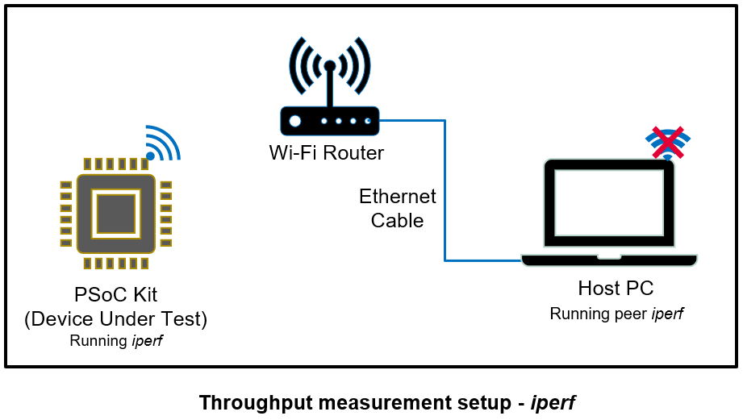

# Command console library

## Introduction

This library provides a framework to add command console support to your application. Support for Wi-Fi, Ethernet, iPerf, and Bluetooth Low Energy commands are bundled with this library.

[ModusToolbox&trade; AnyCloud Tester - Wi-Fi Bluetooth&reg; Console](https://github.com/Infineon/mtb-anycloud-wifi-bluetooth-tester) application is built over this library for Wi-Fi kits.

## Features

- Supports Wi-Fi commands to perform network operations such as scan and join

- Supports Ethernet commands to perform network operations such as ethernet interface up and ethernet interface down.

- Integrates iPerf 2.0 commands. iPerf is a tool for active measurements of the maximum achievable bandwidth on IP networks.

  **Note:** While iPerf provides several other commands, only a subset of commands that are relevant to embedded connectivity use cases is enabled in this library. See the [iPerf commands](#iperf-commands) section.

- Supports TCP client/server and UDP client/server on IPv4. Supports a single instance of the iPerf client and server. IPv6 support will be added in the future.

- Supports Bluetooth&reg; LE commands including Tx/Rx for measuring Bluetooth&reg; LE throughput

## Supported platforms

This library is supported on the following list of platforms/frameworks.

### ModusToolbox&trade;

- [PSoC&trade; 6 Wi-Fi Bluetooth&reg; prototyping kit (CY8CPROTO-062-4343W)](https://www.infineon.com/cms/en/product/evaluation-boards/cy8cproto-062-4343w/)

- [PSoC&trade; 62S2 Wi-Fi Bluetooth&reg; pioneer kit (CY8CKIT-062S2-43012)](https://www.infineon.com/cms/en/product/evaluation-boards/cy8ckit-062s2-43012/)

- [PSoC&trade; 62S2 evaluation kit (CY8CEVAL-062S2-LAI-4373M2)](https://www.infineon.com/cms/en/product/evaluation-boards/cy8ceval-062s2/)

- [PSoC&trade; 62S2 evaluation kit (CY8CEVAL-062S2-MUR-43439M2)](https://www.infineon.com/cms/en/product/evaluation-boards/cy8ceval-062s2/)

- [CYW943907AEVAL1F evaluation kit (CYW943907AEVAL1F)](https://www.infineon.com/cms/en/product/evaluation-boards/cyw943907aeval1f)

- [CYW954907AEVAL1F evaluation kit (CYW954907AEVAL1F)](https://www.infineon.com/cms/en/product/evaluation-boards/cyw954907aeval1f)

- [XMC7200D-E272K8384 kit (KIT-XMC72-EVK)](https://www.infineon.com/cms/en/product/evaluation-boards/kit_xmc72_evk/)

- [XMC7200D-E272K8384 kit (KIT_XMC72_EVK_MUR_43439M2)](https://www.infineon.com/cms/en/product/evaluation-boards/kit_xmc72_evk/)

- [PSoC&trade; 62S2 evaluation kit (CY8CEVAL-062S2-CYW43022CUB)](https://www.infineon.com/cms/en/product/evaluation-boards/cy8ceval-062s2/)

- [CYW955913EVK-01 Wi-Fi Bluetooth&reg; Prototyping Kit (CYW955913EVK-01)](https://www.infineon.com/CYW955913EVK-01)

## Supported frameworks

This library supports the following frameworks:

- **ModusToolbox&trade; environment:** In this environment the command console library uses the [abstraction-rtos](https://github.com/Infineon/abstraction-rtos) library that provides the RTOS abstraction API, and uses the [secure-sockets](https://github.com/Infineon/secure-sockets) library for implementing socket functions. For the Bluetooth&reg; LE functionality, this library uses [BT stack Integration](https://github.com/Infineon/btstack-integration).

## Dependencies

This section provides the list of dependent libraries required for this middleware library to work on FreeRTOS IoT framework.

### ModusToolbox&trade;

- [Wi-Fi connection manager](https://github.com/Infineon/wifi-connection-manager)

- [Ethernet connection manager](https://github.com/Infineon/ethernet-connection-manager)

- [BT stack Integration](https://github.com/Infineon/btstack-integration)


## Quick start

This library is supported on ModusToolbox&trade; frameworks. See the following section to build the library in those frameworks.

### ModusToolbox&trade;

1. For Wi-Fi kits, 
   - To include wifi-connection-manager library, the application should pull [wifi-core-freertos-lwip-mbedtls](https://github.com/Infineon/wifi-core-freertos-lwip-mbedtls) library which will internally pull wifi-connection-manager and other dependent modules.
     To pull wifi-core-freertos-lwip-mbedtls create the following *.mtb* file in deps folder.
     - *wifi-core-freertos-lwip-mbedtls.mtb:*
       `https://github.com/Infineon/wifi-core-freertos-lwip-mbedtls#latest-v1.X#$$ASSET_REPO$$/wifi-core-freertos-lwip-mbedtls/latest-v1.X`

   **Note:** For CYW955913EVK-01, to include wifi-connection-manager library, the application should pull [wifi-core-freertos-lwip-mbedtls](https://github.com/Infineon/wifi-core-freertos-lwip-mbedtls) library which will internally pull wifi-connection-manager and other dependent modules.
     To pull wifi-core-threadx-cat5 create the following *.mtb* file in deps folder.
     - *wifi-core-threadx-cat5.mtb:*
       `https://github.com/Infineon/wifi-core-threadx-cat5#latest-v1.X#$$ASSET_REPO$$/wifi-core-threadx-cat5/latest-v1.X`

2. For Ethernet kits, 
   - To include ethernet-connection-manager library, the application should pull [ethernet-core-freertos-lwip-mbedtls](https://github.com/Infineon/ethernet-core-freertos-lwip-mbedtls) library which will internally pull ethernet-connection-manager and other dependent modules.
     To pull ethernet-core-freertos-lwip-mbedtls create the following *.mtb* file in deps folder.
     - *ethernet-core-freertos-lwip-mbedtls.mtb:*
       `https://github.com/Infineon/ethernet-core-freertos-lwip-mbedtls#latest-v1.X#$$ASSET_REPO$$/ethernet-core-freertos-lwip-mbedtls/latest-v1.X`

3. To pull BT stack Integration create the following *.mtb* file in deps folder.
     - *btstack-integration.mtb:*
       `https://github.com/Infineon/btstack-integration#latest-v4.X#$$ASSET_REPO$$/btstack-integration/latest-v4.X`

   **Note:** BT stack Integration should not be included for CYW955913EVK-01.

4. Review and make the required changes to the pre-defined configuration files and Makefile COMPONENTS in the application.

    - The configuration files for FreeRTOS, lwIP, and Mbed TLS combination are bundled in Wi-Fi core freertos lwip mbedtls library for Wi-Fi kits and in Ethernet core freertos lwip mbedtls library for Ethernet kits.

      - See the "Quick Start" section in [README.md](https://github.com/Infineon/wifi-core-freertos-lwip-mbedtls/blob/master/README.md) of Wi-Fi core freertos lwip mbedtls library for Wi-Fi kits
      - See the "Quick Start" section in [README.md](https://github.com/Infineon/ethernet-core-freertos-lwip-mbedtls/blob/master/README.md) of Ethernet core freertos lwip mbedtls library for Ethernet kits

    - If the application is using bundle library then the configuration files are in the bundle library. For example if the application is using Wi-Fi core freertos lwip mbedtls bundle library, the configuration files are in wifi-core-freertos-lwip-mbedtls/configs folder. Similarly if the application is using Ethernet Core FreeRTOS lwIP mbedtls library, the configuration files are in ethernet-core-freertos-lwip-mbedtls/configs folder.
	
5. A set of COMPONENTS must be defined in the code example project's Makefile for this library

   ```
   COMPONENTS=FREERTOS MBEDTLS LWIP
   ```
   **Note:** For CYW955913EVK-01 the above defines are not applicable.

6. For Wi-Fi kits, to enable the Wi-Fi functionality, add `WCM` to the `COMPONENTS` section in the application's Makefile:

   ```
   COMPONENTS=WCM
   ```

7. For Ethernet kits, to enable the Ethernet functionality, add `ECM` to the `COMPONENTS` section in the application's Makefile:

   ```
   COMPONENTS=ECM
   ```

8. To enable the Bluetooth&reg; LE functionality, add `WICED_BLE` to the `COMPONENTS` section in the application's Makefile:

   ```
   COMPONENTS=WICED_BLE
   ```

9. Add the following compiler directives to the `DEFINES` section in the application's Makefile:

   ```
   DEFINES=HAVE_SNPRINTF
   ```

10. Tune the lwIP configuration parameters listed in application's *lwipopts.h* file, depending on the required Wi-Fi throughput and use case.

    **Note:** For CYW955913EVK-01 the above configuration is not applicable.

## Commands supported

This section lists the Wi-Fi and Bluetooth&reg; LE commands that are natively supported by the command console library.

### Wi-Fi commands

#### *Basic Wi-Fi commands*

Use the following Wi-Fi commands to perform network operations. Enter the following commands after the device boots up and the Wi-Fi module is initialized and ready.

1. Scan for nearby networks:
   ```
   > wifi_scan
	```

2. Connect to a network AP:
   ```
   > wifi_join <ssid> <security type> [password] [channel]
   ```

3. Disconnect from the network AP:
   ```
   > wifi_leave
	```

4. Get the signal strength/RSSI of the network:
    ```
    > wifi_get_rssi
    ```

5. Ping another device on the network:
    ```
    > wifi_ping <ip address>
    ```

**Note:** Wi-Fi commands(scan/join/leave/get_rssi/ping) are retained for backward compatibility. These commands are deprecated and it will be removed in the future release.

### iPerf commands

iPerf commands are used for measuring the Wi-Fi performance/throughput. The _iperf_ sends TCP/UDP data between two peer devices to compute the Wi-Fi performance/throughput.

#### iPerf command options

The following options are supported by the iPerf software integrated into this library. On the console, type `iperf --help` for the list of options supported by the _iperf_ command.

**Note:** The `-w` command is not supported through the command line option; it can be only configured by changing the network stack configuration. See the following notes to configure the TCP window size.

```
> iperf --help

  Usage: iperf [-s|-c host] [options]
         iperf [-h|--help] [-v|--version]

   Client/Server:
   -i, --interval  #         Seconds between periodic bandwidth reports
   -l, --len       #[kmKM]   Length of buffer in bytes to read or write (Defaults: TCP=128K, v4 UDP=1470, v6 UDP=1450)
   -p, --port      #         Server port to listen on/connect to
   -u, --udp                 Use UDP rather than TCP
   -b, --bandwidth #[kmgKMG | pps]  Bandwidth to send at in bits/sec or packets per second for UDP client

   Note:
   -w, --window              TCP window size is not supported through run time option; however, you can configure the TCP window size \n
                             at the build time using the following instructions. The values given for the macros/configurations in the following  section\n
                             are just an example for reference, the actual values of the macros/configuration may vary with your *lwipopts.h* file.
   ```

#### ModusToolbox&trade;:

Update the following configurations in the application's config file 
   
 - FreeRTOS application can make the following configurations in config files (For example, *lwipopts.h*)

   1. For the server, modify/add the following macros with a suitable value to change the TCP window size and pbuf pool size:
      ```
      #define TCP_WND (TCP_MSS * 20)
      #define PBUF_POOL_SIZE 20
      ```

   2. For the client, modify the following macros with a suitable value to change the TCP send buffer size:

      ```
      #define TCP_SND_BUF (TCP_MSS * 20)
      #define MEMP_NUM_TCP_SEG 127
      ```
 - Threadx application can modify/add the following *DEFINES* in *Makefile*.
	
   1. For the server, modify/add *DEFAULT_TCP_WINDOW_SIZE* with a suitable value to change the TCP window size:
      ```
      DEFINES+=DEFAULT_TCP_WINDOW_SIZE=16*1024
      ```

   2. For the client, modify the *NX_TCP_MAXIMUM_TX_QUEUE* with a suitable value to change the TCP send buffer queue size:
      ```
      DEFINES+=NX_TCP_MAXIMUM_TX_QUEUE=20
	  ```
	  **Note:** *NX_TCP_MAXIMUM_TX_QUEUE* is not configurable in CAT5(H1-CP) devices.

 - For an iperf server, DEFAULT_IPERF_SERVER_TIMEOUT_SEC can be used to configure following timeouts
   
    - Amount of time an iperf server waits for a client to connect
   
    - Socket receive timeout of the iperf server

   DEFAULT_IPERF_SERVER_TIMEOUT_SEC can be configured by adding the following *DEFINES* in *Makefile*.
      ```
      DEFINES+=DEFAULT_IPERF_SERVER_TIMEOUT_SEC=10
      ```

   *Server-specific:*

   ```
   -s, --server             run in server mode
   -t, --time      #        time in seconds to listen for new connections as well as to receive traffic (default not set)
   ```

   *Client-specific:*

   ```
   -c, --client    <host>   run in client mode, connecting to <host>
   -n, --num       #[kmgKMG]    number of bytes to transmit (instead of -t)
   -t, --time      #        time in seconds to transmit for (default 10 secs)
   ```

   *Miscellaneous:*

   ```
   -x, --reportexclude [CDMSV]   exclude C(connection) D(data) M(multicast) S(settings) V(server) reports
   -y, --reportstyle C      report as a Comma-Separated Values
   -h, --help               print this message and quit
   -v, --version            print version information and quit
   ```

### iPerf setup

The following diagram shows the exact setup that should be used for measuring the Wi-Fi performance/throughput of a PSoC&trade; device using _iperf_.




### iPerf commands for Wi-Fi throughput measurement

Enter the following commands on the PSoC&trade; device (DUT) after the device boots up and connects to the Wi-Fi network. This section provides only the commands to be run on the DUT. When the 'client _iperf_ command' runs on the DUT, the 'server _iperf_ command' should run on the host PC (as shown in the iPerf Setup diagram), and vice versa.

1. Start iPerf as a TCP server:
	```
	> iperf -s
	```
   **Note:** On the peer iPerf device (host PC), start iPerf as a TCP client to send the TCP data.

2. Start iPerf as a TCP client:
	```
	> iperf -c <server_ip_addr> -t <time in sec>
	```
	**Note:** On the peer iPerf device (host PC), start iPerf as a TCP server.

   Sample command:
	```
	> iperf -c 192.168.0.100 -t 60
	```

3. Start iPerf as a UDP server:
	```
	> iperf -s -u
	```
   **Note:** On the peer iPerf device (host PC), start iPerf as a UDP client to send the UDP data.

4. Start iPerf as a UDP client:
	```
	> iperf -c <server_ip_addr> -t <time in sec> -u -b <band width>
	```
   **Note:** On the peer iPerf device (host PC), start iPerf as a UDP server.

   Sample command:
	```
	> iperf -c 192.168.0.100 -t 60 -u -b 50M
	```

## Tuning for optimal Wi-Fi performance

The TCP and UDP Wi-Fi performance can be tuned using the _iperf_ command options. The TCP window size option impacts the TCP throughput, and bandwidth option (`-b`) impacts the UDP throughput. You can tune the configurations either for TCP or UDP based on the details given in the following sections.

### Tuning the TCP throughput

The TCP window size is configured with a default optimal value in the Wi-Fi Bluetooth&reg; tester applications for PSoC&trade; 6 2M devices. If you are using a different PSoC&trade; device, see the [iPerf command options](#iperf-command-options) section of this document to adjust the configuration for a better TCP throughput. Note that the TCP window size of _iperf_ can be configured only at compile time.

### Tuning the UDP throughput

The iPerf command given in the [iPerf commands for Wi-Fi throughput measurement](#iperf-commands-for-wi-fi-throughput-measurement) section of this document is an ideal command for UDP throughput measurement on PSoC&trade; 6 2M devices. If you are using a different PSoC&trade; device, try different bandwidth values for the _iperf_ `-b` option to measure the UDP throughput.

For example, when you run the command `iperf -c 192.168.0.100 -t 60 -u -b 50M` to measure the UDP Tx throughput on the device, if you see the resulting throughput closer to 50 Mbps, you should run the same command again with the `-b 60M` option and measure the throughput again. If the resulting throughput is different (56 Mbps, which is lesser than 60M, for example), the max UDP Tx throughput supported by the device is 56 Mbps. On the contrary, if the resulting throughput is 27 Mbps with the `-b 50M` option, you should run the same command again with the `-b 30M` option and measure the throughput again. If the resulting throughput in this case is 28 Mbps, this is the max UDP Tx throughput supported by the PSoC&trade; device. Use this as a guideline to identify the real max UDP throughput supported by your device.

### Ethernet commands

#### *Basic Ethernet commands*

Use the following Ethernet commands to perform network operations. Enter the following commands after the device boots up and the Ethernet module is initialized and ready.

1. Bring up the network:
   ```
   > eth_up <Speed type(MII/GMII/RGMII/RMII)> <Link speed(10M/100M/1000M/AUTO)> <Duplex mode(HALF/FULL/AUTO)> <ethernet interface ID(0/1)>
   ```
2. Bring down the network:
   ```
   > eth_down
   ```
3. Set the filters to the hardware:
   ```
   > eth_set_filter
   ```
4. Enable MAC address filtering:
   ```
   > eth_set_filter_address <1-4 supported Filter numbers> <src/dest(Source/Destination)> <X:X:X:X:X:X(MAC address)> <X(Bytes)>
   ```
5. Enable broadcast:
   ```
   > eth_broadcast <1/0(Enable=1,Disable=0)>
   ```
6. Enable promiscuous mode:
   ```
   > eth_set_promiscuous_mode <1/0(Enable=1,Disable=0)>
   ```
7. Ping another device on the network:
   ```
   > eth_ping <ip address>
   ```

## Bluetooth&reg; LE commands

As an example, use the LE connection-oriented channel (CoC) application on a CYW20719B2Q40EVB-01 kit as the Bluetooth&reg; LE peer device to measure the Bluetooth&reg; LE throughput. Ensure that the Bluetooth&reg; LE connection-interval and LE-COC-MTU-size configurations are set to the same value in both the Bluetooth&reg; LE devices that are used for throughput measurement. To modify the Bluetooth&reg; LE connection-interval and MTU, see the [Tuning for optimal Bluetooth&reg; LE performance](#tuning-for-optimal-ble-performance) section.

The following Bluetooth&reg; LE commands are supported in this library:

1. Turn on Bluetooth&reg;:
	```
	> bt_on
	```

2. Turn off Bluetooth&reg;:
	```
	> bt_off
	```

3. Start Bluetooth&reg; LE advertisement:
	```
	> ble_start_adv
	```

4. Stop Bluetooth&reg; LE advertisement:
	```
	> ble_stop_adv
	```

5. Start Bluetooth&reg; LE scan:
	```
	> ble_start_scan
	```

6. Stop Bluetooth&reg; LE scan:
	```
	> ble_stop_scan
	```

7. Initialize LE connection-oriented channel (CoC):
	```
	> ble_coc_init
	```
   **Note:** LE CoC will be initialized with an MTU size of 100 and local Protocol Service Multiplexer (PSM) 0x19.

8. Start LE CoC advertisement:
	```
	> ble_coc_adv
	```

9. Scan and connect to a remote Bluetooth&reg; LE device running the LE CoC app on the CYW20719B2Q40EVB-01 device:
	```
	> ble_coc_scan_connect
	```

10. Disconnect an LE CoC connection:
	```
	> ble_coc_disconnect
	```

11. Send LE CoC data:
	```
	> ble_coc_send_start
	```

12. Stop sending LE CoC data:
	```
	> ble_coc_send_stop
	```

13. Get the throughput:
	```
	> ble_get_throughput
	```

14. Get the device address:
	```
	> bt_get_device_address
	```
### Tuning for optimal Bluetooth&reg; LE performance

Bluetooth&reg; LE performance can be tuned using the Bluetooth&reg; LE connection-interval and LE-COC-MTU-size configurations. Ensure that the Bluetooth&reg; LE  connection-interval and LE-COC-MTU-size configurations are set to the same value in both the Bluetooth&reg; LE devices that are used for throughput measurement.

For a given MTU size, if the configured connection interval is low, the resulting throughput will be higher, and vice-versa.

### Modifying Bluetooth&reg; LE configurations on a PSoC&trade; device

**ModusToolbox&trade;:** (Infineon Bluetooth&reg; stack)

1. The connection interval value is configured in multiples of 1.25 milliseconds based on the connection interval assigned in the Bluetooth&reg; LE configuration structure.

   By default, the library sets the Bluetooth&reg; LE connection interval configuration value to 40 which computes to a connection interval time of 50 msec (40 * 1.25 msec). The connection interval can be modified through a build macro.

   Add the `BLE_CONNECTION_INTERVAL` macro to the *DEFINES* in the application's Makefile. If the connection interval needs to be set to 24, the Makefile entry would look like as follows:

    ```
    DEFINES += BLE_CONNECTION_INTERVAL=24
    ```
   For the range of connection interval that can be configured, see [Bluetooth&reg; LE connection interval](https:///infineon.github.io/btstack/ble/api_reference_manual/html/group__wiced__bt__cfg.html#ga4b1a4ba915ebe81ea7c7771f44f5cd07).

2. By default, `BLE_COC_MTU_SIZE` is set to 100 bytes; the max value that can be configured is 512 bytes. To modify this to 200, do the following:

   Add the `BLE_COC_MTU_SIZE` macro to the *DEFINES* in the application's Makefile. The Makefile entry would look like as follows:

    ```
    DEFINES += BLE_COC_MTU_SIZE=200
    ```

### Modifying Bluetooth&reg; LE configurations on a peer device

Do the following to modify the connection interval and MTU on the peer LE COC application running on the CYW20719B2Q40EVB-01 device:

1. The connection interval of LE COC application can be modified by changing the min and max connection interval values of BLE scan configuration structure in *le_coc_cfg.c*.By default, the connection interval of the PSoC&trade; device is set to 40. To set the same value, use the configuration given below:

    ```
    ble_scan_cfg =
    {
        ...
        /* Connection configuration */
        .conn_min_interval               = 40,
        .conn_max_interval               = 40,
        ...
    },
    ```
2. Configure the MTU using the client control tool:

   1. Right-click the LE_Connection_Oriented_Channel project on the Eclipse IDE for ModusToolbox&trade;.  Navigate to *ModusToolbox&trade;* and then select **ClientControl** from the floating window menu.

   2. Select the appropriate **WICED HCI UART** from the drop-down list and then click **Open Port**.

   3. Select the **LE COC** tab to set the required MTU size.

   4. Click **Close Port**, reset the CYW20719B2Q40EVB-01 device, and then click **Open Port** for these settings to take effect.

### Understanding the Bluetooth&reg; LE throughput

This section explains the theoretical Bluetooth&reg; LE throughput numbers achievable on a Bluetooth&reg; LE platform based on the configuration.

The theoretical Bluetooth&reg; LE throughput can be calculated using the following formula:

 **Throughput = (MTU size in bits) / (connection interval in seconds)**

The following default values are used in this library:

    - Default connection interval = 50 ms

    - Default MTU size = 100 bytes

The theoretical Bluetooth&reg; LE throughput achievable for  these default values can be calculated as follows:

   = (100 * 8) / (50 / 10^3)
   = (800 / 0.050)
   = 16,000 bps
   = 16 kbps

## Adding new console commands in an application

1. Initialize the command console framework:
	```
	cy_command_console_init
	```

   You should define the commands table and the handler along with the primary library. For example, the WHD library console commands may be placed in *WHD_utils* and located along with the WHD library. The test application will invoke the relevant function in *WHD_utils* for adding the commands.

2. Define the commands as shown in the following example:
	```
	#define MY_COMMANDS    \
		{ "mycmd1", my_command1, 0, NULL, NULL, (char *)"", (char *)"Run mycmd1 --help for usage."}, \
		{ "mycmd2", my_command2, 0, NULL, NULL, (char *)"", (char *)"Run mycmd2 --help for usage."}, \
	```

4. Define the command table:
	```
	const cy_command_console_cmd_t my_command_table[] =
	{
		MY_COMMANDS
		CMD_TABLE_END
	};
	```

5. Implement command handlers when the commands are executed on the console.

   In this example, implement `my_command1` and `my_command2` function handlers.

6. Add the command table to the console:
	```
	cy_command_console_add_table( my_command_table )
	```

7. De-register the command table:
	```
	cy_command_console_delete_table( my_command_table )
	```
## Configuring Command set based on user needs

**ModusToolbox&trade;:**

   By default, `Wifi`, `Ethernet`, `bluetooth` and `iperf` utilities are enabled. To disable any of these utilities add the following to the Makefile of the application.

   To disable Wi-Fi commands:
   ```
   DEFINES+=DISABLE_COMMAND_CONSOLE_WIFI
   ```
   To disable Ethernet commands:
   ```
   DEFINES+=DISABLE_COMMAND_CONSOLE_ETH
   ```
   To disable iperf command:
   ```
   DEFINES+=DISABLE_COMMAND_CONSOLE_IPERF
   ```
   To disable bluetooth commands:
   ```
   DEFINES+=DISABLE_COMMAND_CONSOLE_BT
   ```

## Additional information

- [Command console RELEASE.md](./RELEASE.md)

- [Command console API reference guide](https://infineon.github.io/command-console/api_reference_manual/html/index.html)

- [ModusToolbox&trade; software, quick start guide, documentation, and videos](https://www.infineon.com/cms/en/design-support/tools/sdk/modustoolbox-software/)

- [Command console version](./version.xml)
